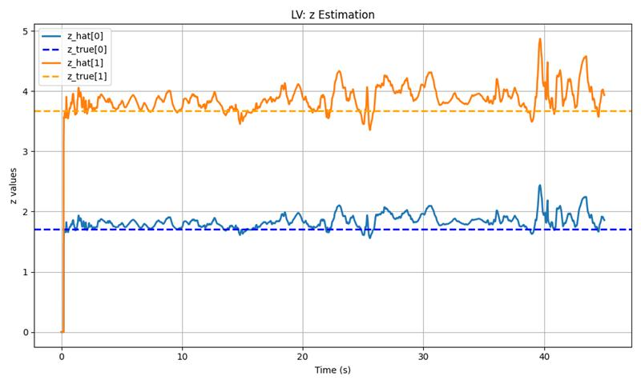

# Adaptation Module

### Branch Description

This branch adds an addaptation module to the pipeline inspired in the Extreme Adaptation Controller paper ([Zhang et al.](https://arxiv.org/pdf/2409.12949)).

To create the adaptation module, we expand the observation input of the policy to include a latent represenation $z_t$, which is an encoded vector of the environmental vector $e_t$. That is to say, $z_t = \mu (e_t)$.

$$e_t = \begin{bmatrix} 
m & J & l & C_{Dx} & C_{Dy}
\end{bmatrix}$$
$$\mathbf{o} =
\begin{bmatrix}
e_{px} &
e_{py} &
e_{vx} &
e_{vy} &
a_{x,ref} &
a_{y,ref} &
\sin(\theta) &
\cos(\theta) &
\omega &
z_t
\end{bmatrix}^T \ \in \mathcal{R}^{11}
$$

This way during the policy training (Phase 1), the encoder $\mu$ is trained to compress the environmental vector and produce a meaninguful represenation of the environmental parameters for the policy.

Once the policy $\pi$ and the encoder $\mu$ are trained. We train the adaptation module $\phi$ (Phase2). The adaptation module is a CNN that takes the last 20 state-action pairs and has to estimate the latent representation $z_t$. Hence the training loss for this phase is:

$$\mathcal{L_\phi} = ||z_t-\hat{z}_t||^2$$

### Benefits
This way the policy is able to adapt to sudden changes in the environmental parameter. During a rollout I changed the mass at a random time step and the policy adapted inmediatelly!

